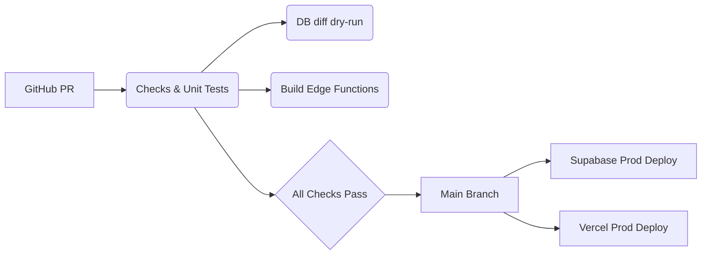

# Momentum — Supabase Product Design Document
*Version 1.0 — generated 2025-06-24*

---

## 1 · Product Vision
Momentum is a goal-oriented coaching platform that guides users from goal capture through daily reflection to actionable weekly insights.  
The system must be **privacy-first**, **cost-predictable**, and **fast to iterate**.

---

## 2 · High-Level Requirements
| ID | Requirement | Priority |
|----|-------------|----------|
| R1 | Secure user authentication with email, social, & magic-link | High |
| R2 | Daily prompts delivered at local 20:00 user time | High |
| R3 | Weekly PDF report summarising progress | Medium |
| R4 | Token-based usage accounting with hard caps per tier | High |
| R5 | Stripe-based subscriptions with self-service portal | High |
| R6 | Real-time dashboard for streaks & metrics | Medium |

---

## 3 · System Architecture

```
Client (Web React / iOS SwiftUI)
           │
    supabase-js / supabase-swift
           │
┌─────────────────────────────┐
│         Supabase           │
│  - Postgres (row data)      │
│  - Storage (media)          │
│  - Auth (JWT)               │
│  - Realtime (listen)        │
│  - Edge Functions (Deno)    │
│  - Cron Scheduler           │
└─────────────────────────────┘
           │
Stripe → Webhook → Edge Function
OpenAI API → invoked from Edge Functions
```

---

## 4 · Tech Stack
| Layer | Technology / Service |
|-------|----------------------|
| **Cloud Platform** | Supabase (EU-West primary, US-East read-replica) |
| **Database** | Postgres 15 + pgvector |
| **Edge Functions** | TypeScript (Deno 1.40) |
| **Web Client** | Next.js 14, React 19, tRPC v11 |
| **iOS Client** | Swift 5.10, SwiftUI, Combine |
| **Design System** | Tailwind CSS + Radix UI primitives |
| **CI/CD** | GitHub Actions → Supabase CLI, Vercel, TestFlight |
| **Monitoring** | Sentry, Logflare, Grafana-based pg_metrics |
| **Analytics** | PostHog (self-hosted) |

---

## 5 · Authentication & Authorization
* **Methods**: Email/password, Apple ID, Google OAuth, Magic-link.  
* **JWT lifetime**: 60 min, refresh token 7 days.  
* **Row-Level Security**: Enabled on every table with `user_id = auth.uid()` policy.  
* **Admin Access**: Service-role key held only in Edge Functions.

---

## 6 · Core Database Schema (DDL)
```sql
create extension if not exists "pgcrypto";

create table goals (
  id          uuid primary key default gen_random_uuid(),
  user_id     uuid references auth.users on delete cascade,
  text        text not null,
  timeline    text,
  metrics     text,
  archived    boolean not null default false,
  created_at  timestamptz not null default now(),
  updated_at  timestamptz not null default now()
);

create table reflections (
  id          uuid primary key default gen_random_uuid(),
  user_id     uuid references auth.users on delete cascade,
  date        date not null,
  prompts     jsonb not null,
  answers     jsonb not null,
  created_at  timestamptz not null default now()
);

create table weekly_reports (
  id          uuid primary key default gen_random_uuid(),
  user_id     uuid references auth.users on delete cascade,
  week_start  date not null,
  summary     jsonb not null,
  pdf_url     text,
  created_at  timestamptz not null default now()
);

-- Token usage ledger
create table gpt_token_usage (
  id          uuid primary key default gen_random_uuid(),
  user_id     uuid references auth.users on delete cascade,
  month_start date not null,
  tokens      int  not null default 0,
  cost_cents  int  not null default 0,
  constraint unique_month unique (user_id, month_start)
);
```

---

## 7 · Edge Functions

| Name | Trigger | Purpose |
|------|---------|---------|
| `bootstrap_new_user` | Auth *after signup* webhook | Seed default rows and free-trial budget |
| `daily_prompt_job` | Supabase Cron hourly | At 20:00 local, generate and insert daily prompts |
| `weekly_report_job` | Supabase Cron Sunday 03:00 UTC | Aggregate week, craft PDF, email link |
| `token_guard` | HTTPS callable | Verify remaining budget before OpenAI call |
| `stripe_webhook` | HTTPS POST | Handle subscription lifecycle events |
| `streak_updater` | Realtime `reflections` insert | Increment current streak & emit socket event |
| `deletion_sweeper` | Cron nightly | Purge accounts queued for deletion >30 days |

---

## 8 · Client Application Flow

1. **Onboarding**  
   * Sign-up → `bootstrap_new_user` seeds rows → App navigates to *Add Goals* screen.  
2. **Goal Capture**  
   * User enters plain-text goals. POST `/rpc/save_goals` stores records.  
3. **Daily Prompt Cycle**  
   * Scheduler inserts prompts. Push notification delivered.  
   * User answers → `/rpc/save_reflection` function stores answers and triggers `streak_updater`.  
4. **Weekly Report**  
   * Job builds PDF, stores in Supabase Storage, emails signed URL.  
5. **Usage Guard**  
   * Before each GPT request the client hits `token_guard`. If over limit → require upgrade.

---

## 9 · Rate Limiting & Budgeting
* Monthly token ceiling by tier (Free → 15k, Starter → 100k, Pro → 500k).  
* `gpt_token_usage` tracked in transaction with GPT call.  
* Edge Function rejects requests exceeding remaining quota with HTTP 402.

---

## 10 · Payments & Subscriptions
* Stripe Checkout for plan purchase, Stripe Customer Portal for self-serve management.  
* Webhook updates `stripe_subscriptions` table and issues role in `auth.users`.  
* Grace period: 3 days after failed payment before downgrade.

---

## 11 · Security & Compliance
* **Encryption**: TLS 1.3 in transit; AES-256 at rest (disk-level).  
* **Back-ups**: Point-in-time WAL + daily snapshot retained 35 days.  
* **Secrets**: Stored in Supabase Secrets manager; never committed to VCS.  
* **GDPR**: Data export & deletion endpoints (`/edge/gdpr_export`).  
* **Audit Logs**: Inserts to `admin.audit_log` via triggers.

---

## 12 · Observability
* **Metrics**: `pg_stat_statements`, Supabase dashboard.  
* **Tracing**: OpenTelemetry SDK forwarding to Grafana Tempo.  
* **Alerts**: PagerDuty on p99 latency >1s or error rate >2%.

---

## 13 · Deployment Pipeline


---

## 14 · Future Enhancements
* **Workspace sharing** — collaborative goal setting.  
* **Media timeline** — photo & song timeline stored in Supabase Storage.  
* **Vector search** — pgvector embeddings for smarter reflection retrieval.  
* **Push campaigns** — personalised streak reminders.

---

## 15 · Appendix
* **ERD** — see `/docs/erd.drawio`.  
* **API Reference** — auto-generated by tRPC OpenAPI plugin.  
* **Glossary** — goal, reflection, streak, token, tier.

---

© Momentum 2025. All rights reserved.
